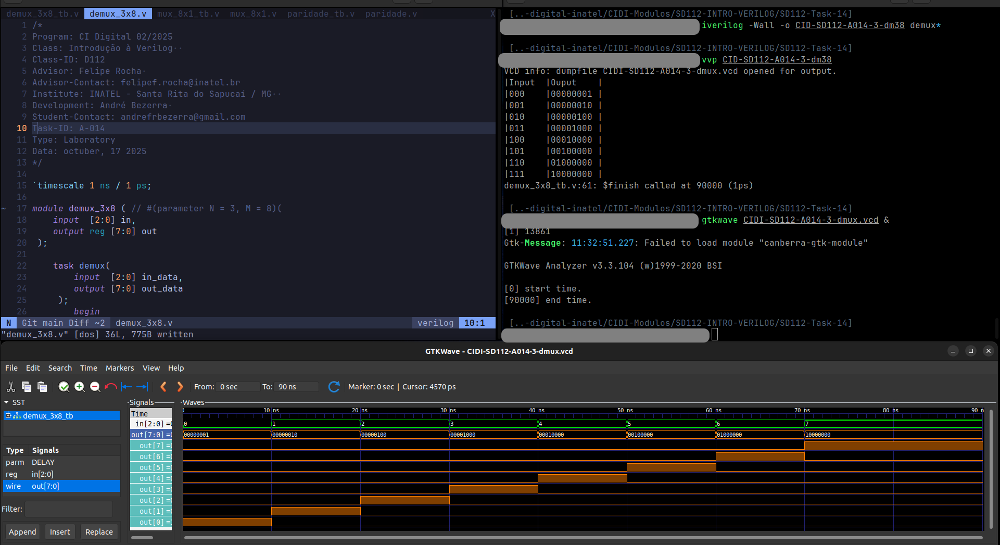

# Atividade A-014 / SD-112

> Conteúdo descritivo e analítico

>  Codificação de Síntese vs Simulação

:white_check_mark: Implementar um código em Verilog, que seja sintetizável, para realizar o cálculo de paridade. O resultado deve ser 1 se o número de bits 1 for ímpar, e 0 caso contrário.

:white_check_mark: Resolver este exercício utilizando uma função.

:white_check_mark: Implementar uma task que mapeie uma entrada de 3 bits em um barramento ativável de 8 bits, onde apenas uma entrada deve ser habilitada. Por exemplo, a entrada d_in [3:0] = 3 ’ b000 indica que apenas o valor d_out [0] deve ser igual a 1; já para d_in [3:0] = 3 ’ b111 apenas d_out [7] deve ser 1.

:white_check_mark: Implementar uma task que gere todos os padrões de teste para um multiplexador de 8 entradas, utilize delays para simulação.


## Executar

> Comandos para analisar / testar comportamento dos módulos: 

### GTKwave

```
$ vvp CIDI-SD112-A014-<...>

$ gtkwave CIDI-SD112-A014-<...>.vcd
```

### ModelSim

> 

```
$ do execute-task.do
```


## Fluxograma


## Results




[> Google Drive - General Report](https://docs.google.com/document/d/1XcMPJY77fL6TMtBvcFznFPcfbmsb3IuBN67DL6YdwVo)
