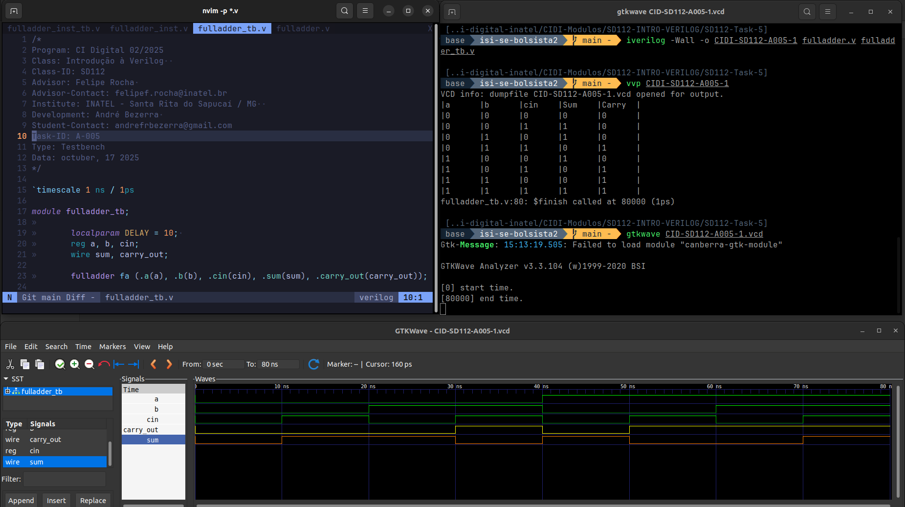
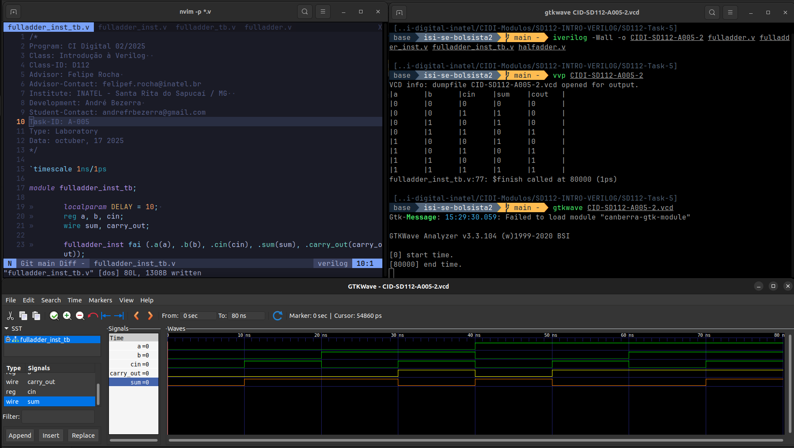

# Atividade A-005 / SD-112

> Conteúdo descritivo e analítico

> Full Bit Adder

:white_check_mark: Escrever um código Verilog que implemente um full adder utilizando operadores que descrevem portas lógicas.


:white_check_mark:  Definir uma testbench simples para validar o funcionamento do full adder.

:white_check_mark: Gerar combinações possíveis para a, b e cin ou seja, os valores binários de acordo com a Tabela da Verdade.

:white_check_mark: Pesquisa e implementar um full adder instanciando 2 half adders e uma porta OU.

## Executar

> Comandos para analisar / testar comportamento dos módulos:

### GTKwave

```
$ vvp CIDI-SD112-A005

$ gtkwave CIDI-SD112-A005.vcd
```

### ModelSim

> 

```
$ do execute-task.do
```


## Fluxograma


## Results




[> Google Drive - General Report](https://docs.google.com/document/d/1XcMPJY77fL6TMtBvcFznFPcfbmsb3IuBN67DL6YdwVo)
