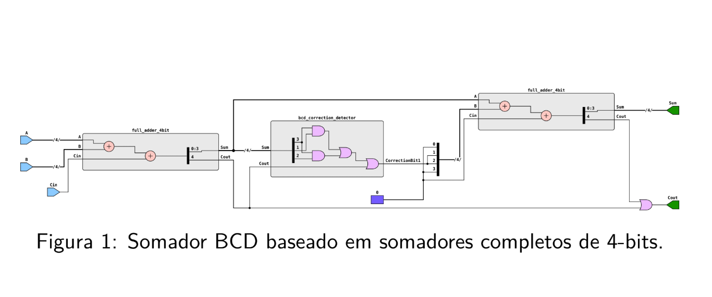
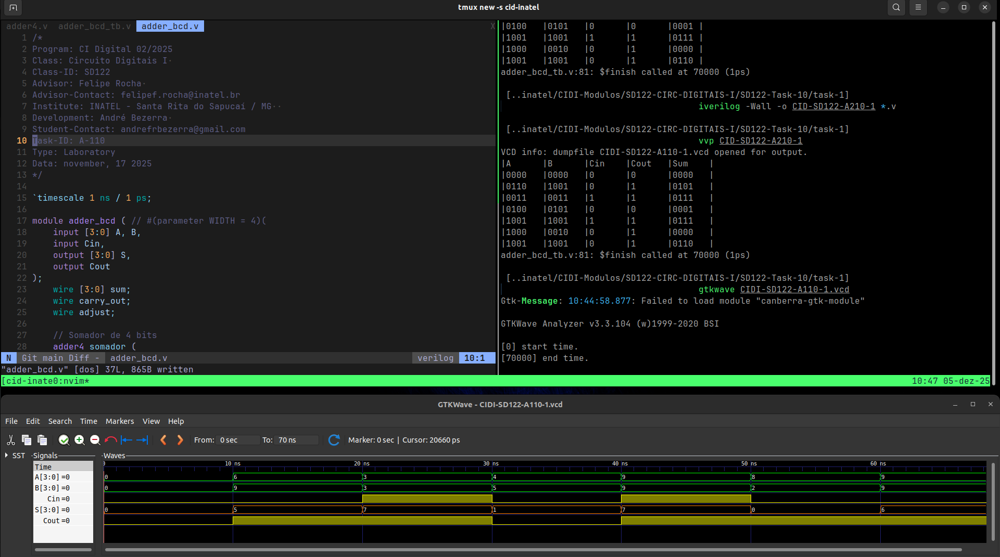
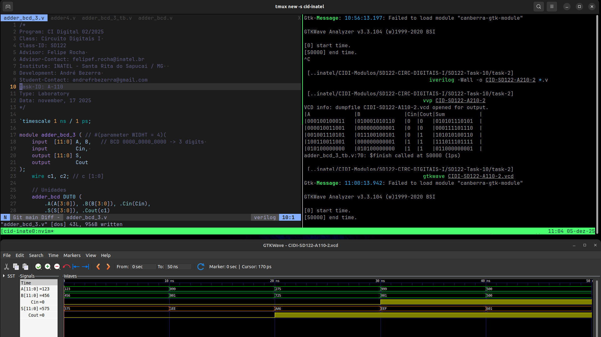

# Atividade A-110 / SD-122

> Conteúdo descritivo e analítico

> Somadores BCD​

:white_check_mark: ​ Implementação de​​ ​circuito​ ​somador​ ​BCD​;

- 


## Executar

> Comandos para analisar / testar comportamento dos módulos: 

### GTKwave

```
$ vvp CIDI-SD122-A110

$ gtkwave CIDI-SD122-A110.vcd
```

### ModelSim

> 

```
$ do execute-task.do
```


## Fluxograma



## Results




[> Google Drive - General Report](https://docs.google.com/document/d/1XcMPJY77fL6TMtBvcFznFPcfbmsb3IuBN67DL6YdwVo)
