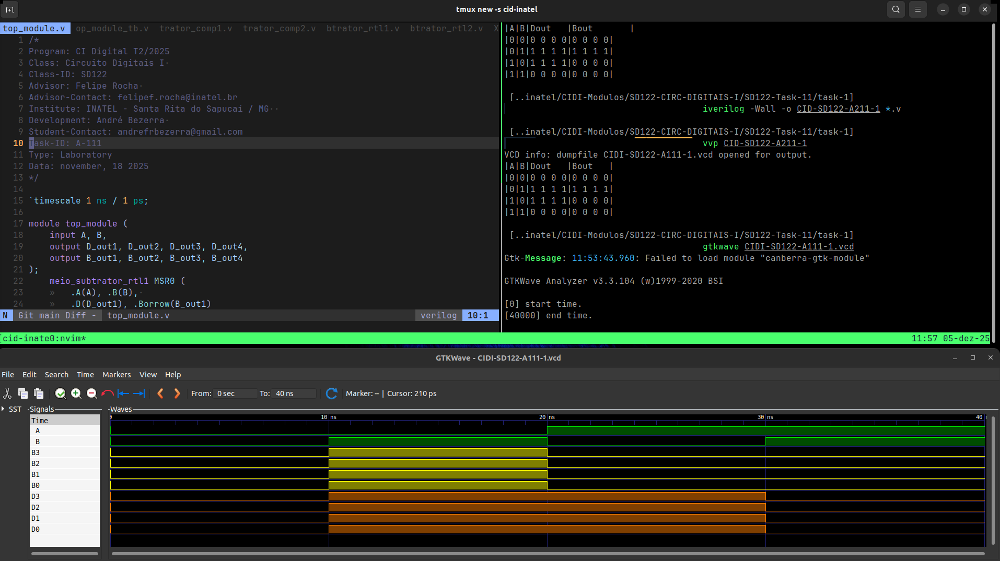
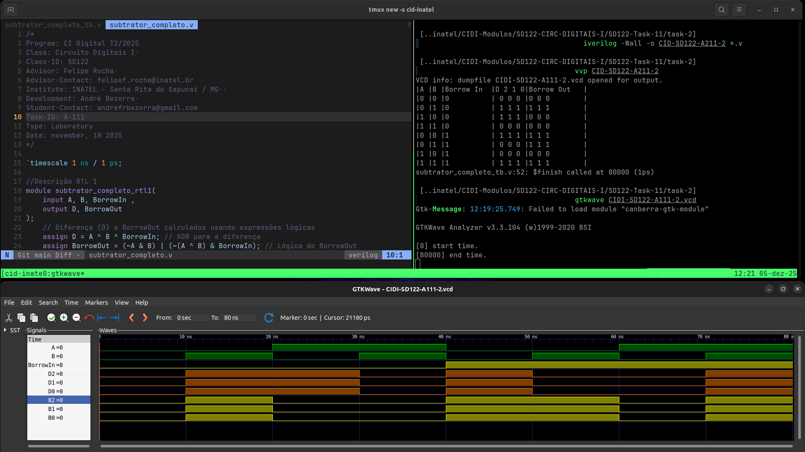

# Atividade A-111 / SD-122

> Conteúdo descritivo e analítico

>  Meio subtrator, subtrator completo​ e  ​Subtrator paralelo e Somador-subtrator​

:white_check_mark: Testbench para testar as 4 descrições fornecidas para o​ circuito meio subtrator.

:white_check_mark: Testbench para testar as 3 descrições fornecidas para o​ circuito subtrator completo.​

:white_check_mark: Implementar um circuito subtrator de 4-bits baseado em complemento de 2.

## Executar

> Comandos para analisar / testar comportamento dos módulos: 

### GTKwave

```
$ vvp CIDI-SD122-A111

$ gtkwave CIDI-SD122-A111.vcd
```

### ModelSim

> 

```
$ do execute-task.do
```


## Fluxograma


## Results





[> Google Drive - General Report](https://docs.google.com/document/d/1XcMPJY77fL6TMtBvcFznFPcfbmsb3IuBN67DL6YdwVo)
