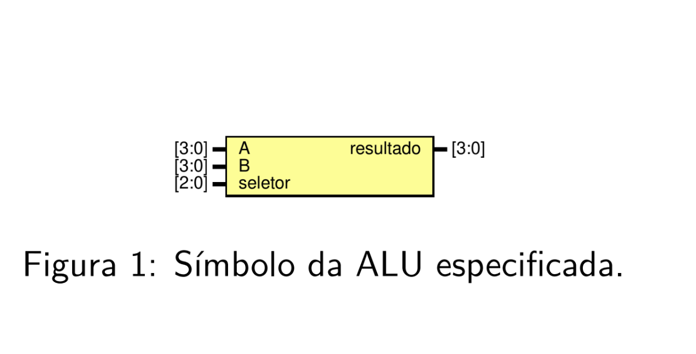
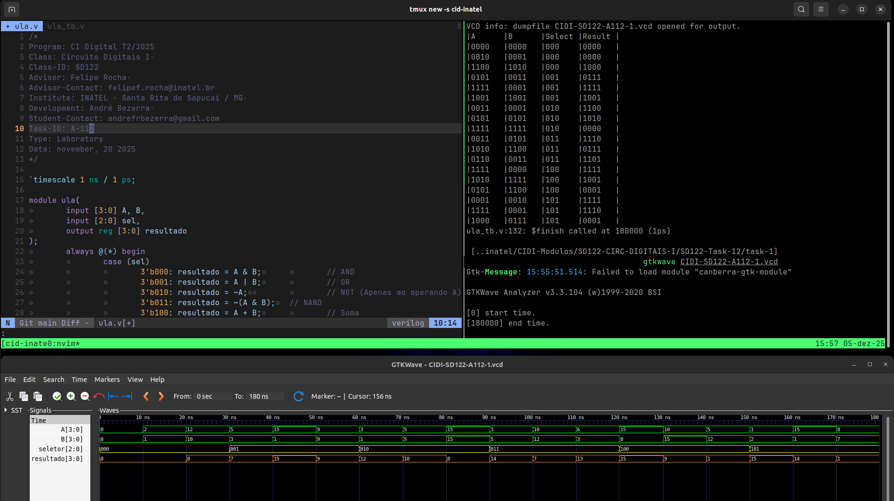

# Atividade A-112 / SD-122

> Conteúdo descritivo e analítico

> Unidade Lógica e Aritmética (ALU)​
 ​
:white_check_mark: ​Implementar ​a​ ​ALU​ ​para​ ​realizar​ ​as​ ​operações​ ​aritméticas​ ​e​ ​lógicas​ especificadas ​​em ​​dois ​​operandos ​​de ​​4​​bits.

:white_check_mark: Utilizar​ ​três​ ​módulos​ ​da​ ​ULA​ e​ ​realizar​ ​a​ ​expansão​ ​para​ ​uma​ ULA de 12-bits.​


## Executar

> Comandos para analisar / testar comportamento dos módulos: 

### GTKwave

```
$ vvp CIDI-SD122-A112

$ gtkwave CIDI-SD122-A112.vcd
```

### ModelSim

> 

```
$ do execute-task.do
```


## Fluxograma



## Results




[> Google Drive - General Report](https://docs.google.com/document/d/1XcMPJY77fL6TMtBvcFznFPcfbmsb3IuBN67DL6YdwVo)
