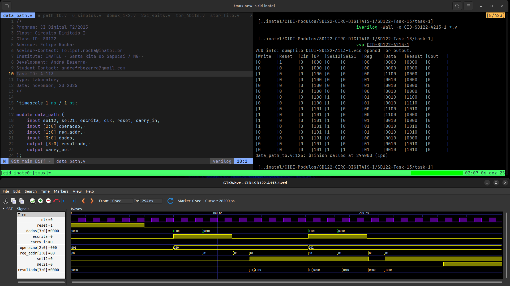
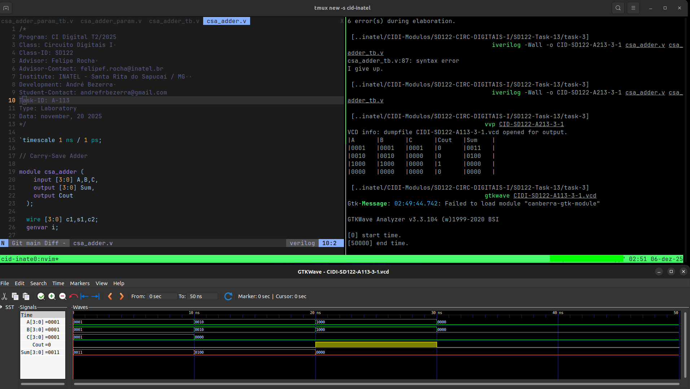
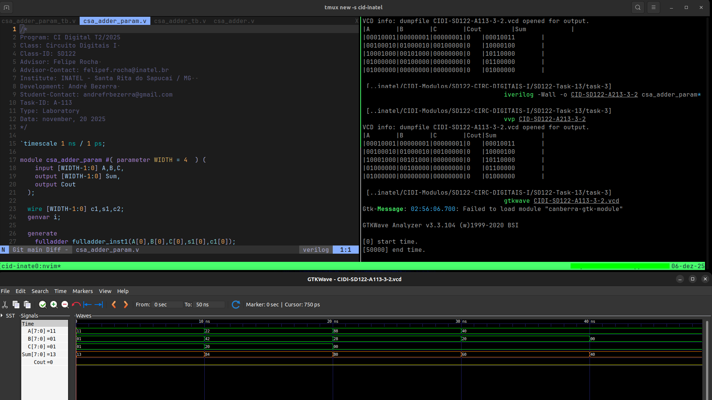

# Atividade A-113 / SD-122

> Conteúdo descritivo e analítico

> Aplicação da ULA, ULA comercial 78181,​ Árvores de Soma - CSA e Algoritmo Brent-Kung​

:white_check_mark: Implementar o datapath de 4-bits;

:white_check_mark: Implementar ​​a ​​ULA ​​74181;

:white_check_mark: ​Projetar ​​um ​​Carry-Save ​​Adder​​(CSA);​​

​:white_check_mark: Brent-Kung Adder;

- [ ] Kogge-Stone Adder;

- [ ]  Sklansky Adder; 

## Executar

> Comandos para analisar / testar comportamento dos módulos: 

### GTKwave
oo
```
$ vvp CIDI-SD122-A113

$ gtkwave CIDI-SD122-A113.vcd
```

### ModelSim

> 

```
$ do execute-task.do
```


## Fluxograma


## Results






[> Google Drive - General Report](https://docs.google.com/document/d/1XcMPJY77fL6TMtBvcFznFPcfbmsb3IuBN67DL6YdwVo)
