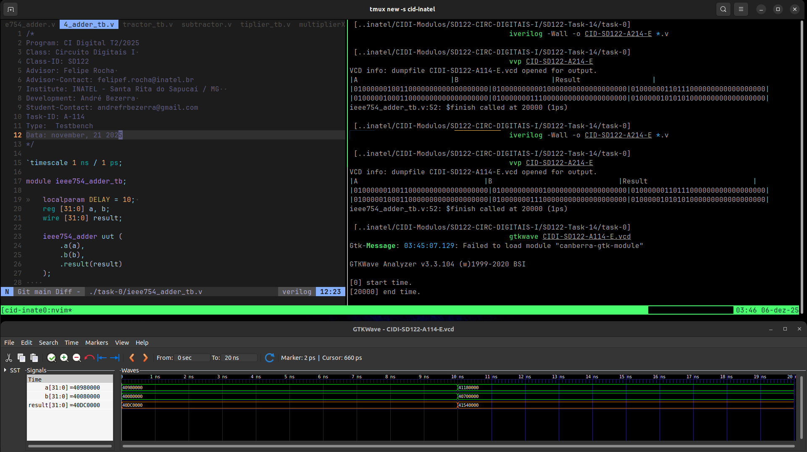

# Atividade A-114 / SD-122

> Conteúdo descritivo e analítico

> Aritmética de Ponto Fixo e Flutuante​
 
:white_check_mark:

​:white_check_mark: 


## Executar

> Comandos para analisar / testar comportamento dos módulos: 

### GTKwave

```
$ vvp CIDI-SD122-A114

$ gtkwave CIDI-SD122-A114.vcd
```

### ModelSim

> 

```
$ do execute-task.do
```


## Fluxograma


## Results



[> Google Drive - General Report](https://docs.google.com/document/d/1XcMPJY77fL6TMtBvcFznFPcfbmsb3IuBN67DL6YdwVo)
