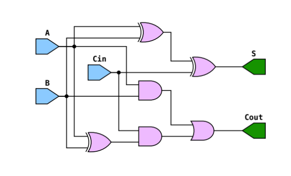
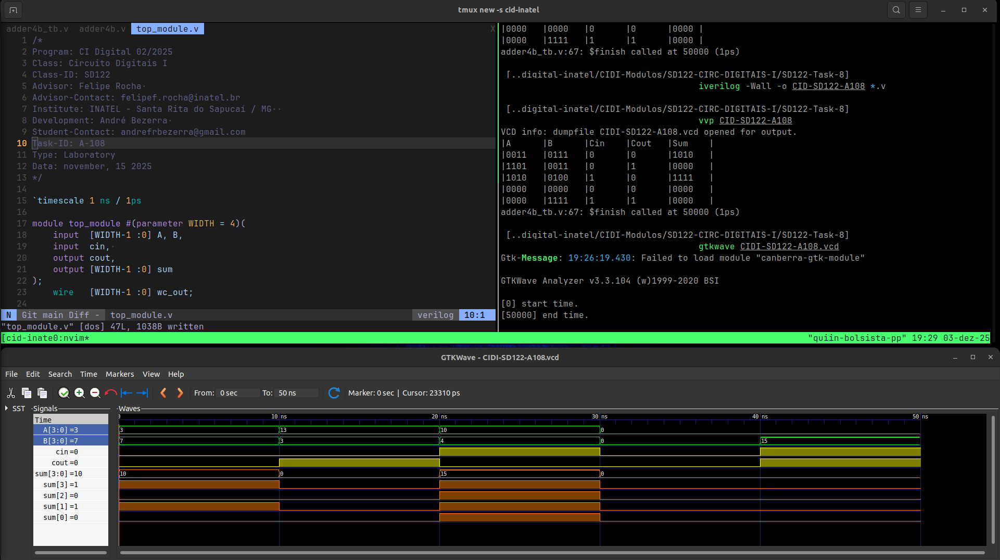

# Atividade A-108 / SD-122

> Conteúdo descritivo e analítico

> Meio somador e Somador Completo​

:white_check_mark: Desenvolver um somador de 4 bits utilizando descrição estrutural em​ **Verilog**.​
​
​:white_check_mark: ​​Definir um​​ módulo​​ **full_adder​**, ​​que implemente​​ o ​​funcionamento ​​de​ um ​​somador ​​completo ​​de ​​1 ​​bit​​(receber ​​2​​ bits ​​de​​ entrada​​ e ​​um ​​carry-in,​​e​ produzindo a soma e o carry-out).​

:white_check_mark: Definir um ​ ​o​ ​módulo​ ​do​ ​somador​ ​de​ ​4​ ​bits,​ ​realizando​ ​a​ ​**instancia​ ​de​ quatro full-adders conectados em cascata**.​
​
​:white_check_mark: Definir ​um​​ ​testbench​ ​que​ ​instancie​ ​um​​ somador​ de 4 bits e verifique as seguintes condições de Soma: 
​
:white_check_mark:  simples, sem geração de carry (carry in = 0).;
​
​:white_check_mark: que resulta em carry interno (carry in = 0);​
​
​:white_check_mark: com entrada de carry in ativa;
​​
:white_check_mark: com ambos os operandos iguais a zero (carry in = 0);​
​
​:white_check_mark: com carry in ativo e geração de carry out na saída.​


## Executar

> Comandos para analisar / testar comportamento dos módulos:  

### GTKwave

```
$ vvp CIDI-SD122-A108

$ gtkwave CIDI-SD122-A108.vcd
```

### ModelSim

> 

```
$ do execute-task.do
```


## Fluxograma



## Results



[> Google Drive - General Report](https://docs.google.com/document/d/1XcMPJY77fL6TMtBvcFznFPcfbmsb3IuBN67DL6YdwVo)
