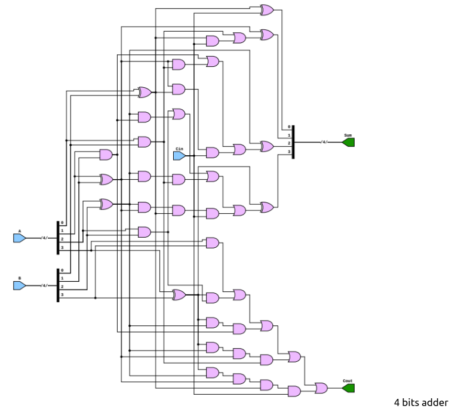
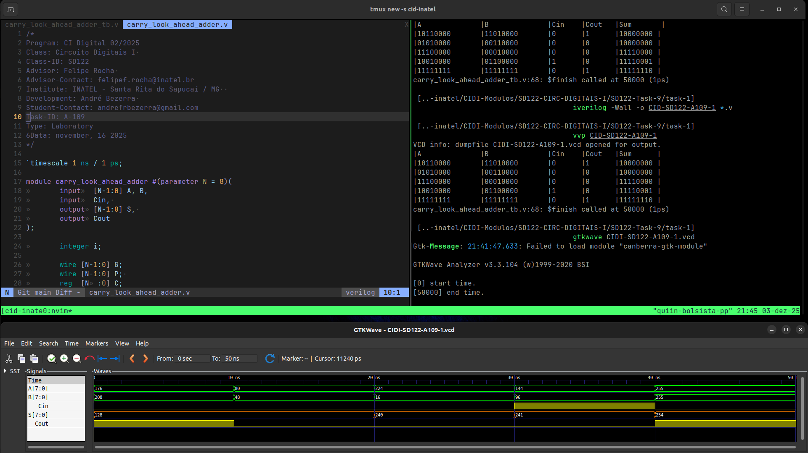
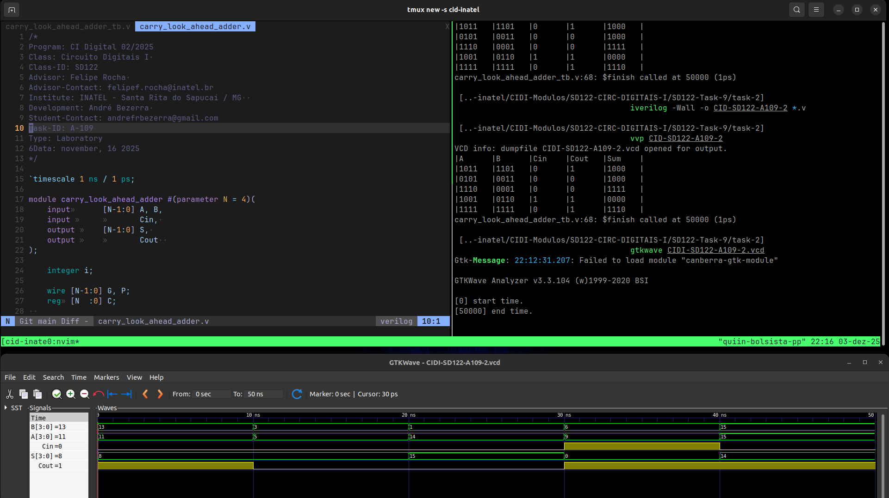
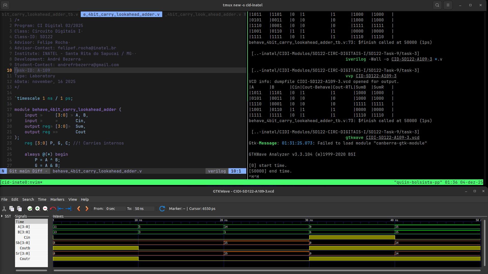
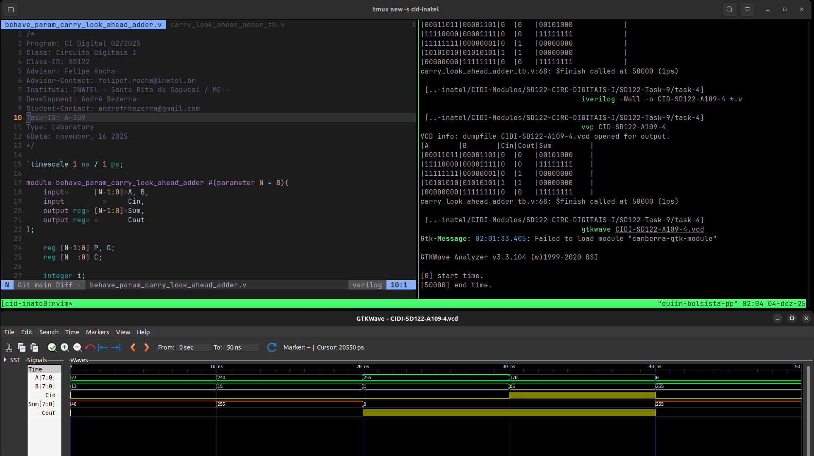

# Atividade A-109 / SD-122

> Conteúdo descritivo e analítico

> Somador com carry look-ahead​
 ​
:white_check_mark:


- 


## Executar

> Comandos para analisar / testar comportamento dos módulos:  

### GTKwave

```
$ vvp CIDI-SD122-A109

$ gtkwave CIDI-SD122-A109.vcd
```

### ModelSim

> 

```
$ do execute-task.do
```


## Fluxograma



## Results






[> Google Drive - General Report](https://docs.google.com/document/d/1XcMPJY77fL6TMtBvcFznFPcfbmsb3IuBN67DL6YdwVo)
