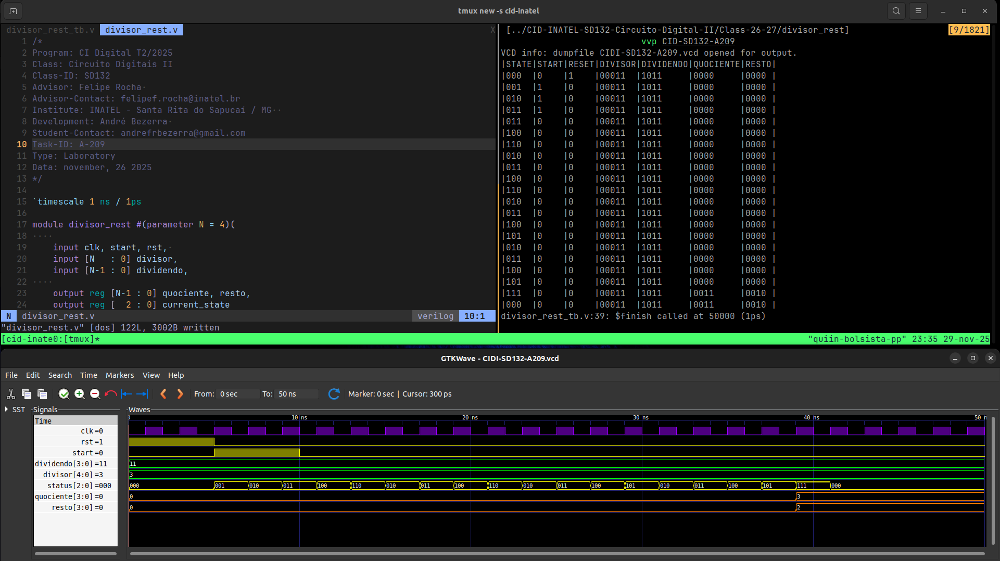

# Atividade A-209 / SD-132

> Conteúdo descritivo e analítico

> Divisor controlado por FSM​

:white_check_mark: Algoritmo​ ​de​ ​divisão​ ​de​ ​inteiros​ ​com​ ​restauração.

## Executar

> Comandos para analisar / testar comportamento dos módulos:

### GTKwave

```
$ vvp CIDI-SD132-A209

$ gtkwave CIDI-SD132-A209.vcd
```

### ModelSim

> 

```
$ do execute-task.do
```


## Fluxograma

> Ferramenta utilizada [Draw.io]();


## Results




[> Google Drive - General Report](https://docs.google.com/document/d/1ONek1qarL9ffCkK64y7RGFRO1fsGOx6Uon5N0k2VMTU/edit?usp=sharing)
