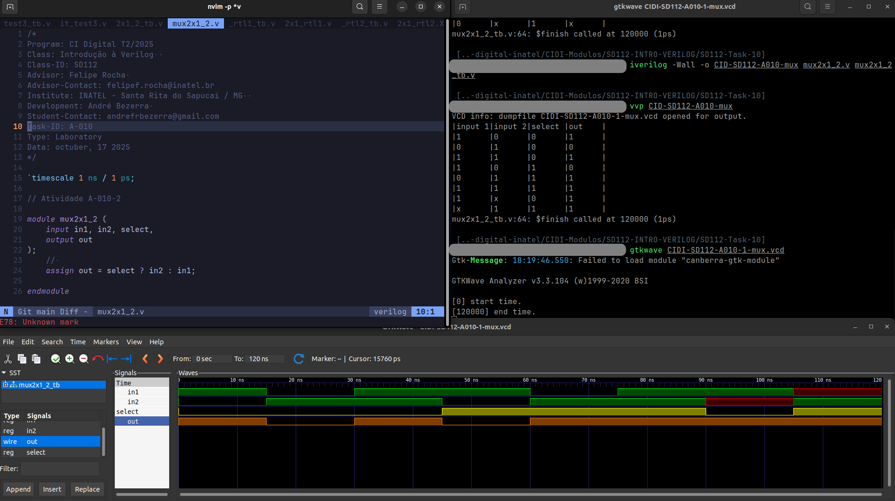
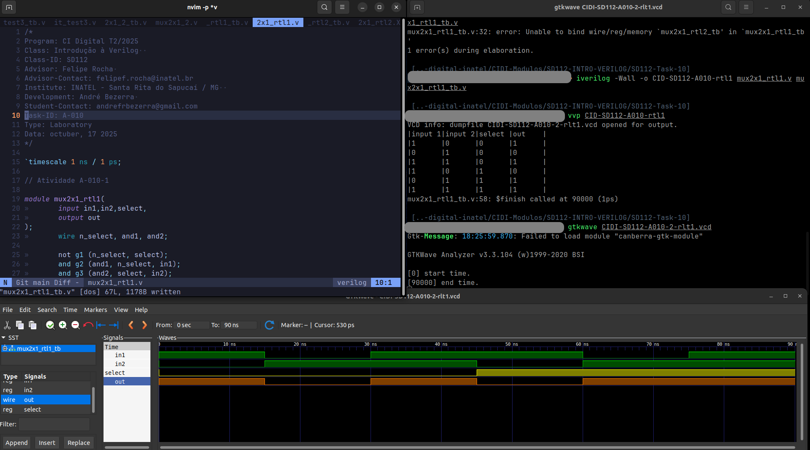
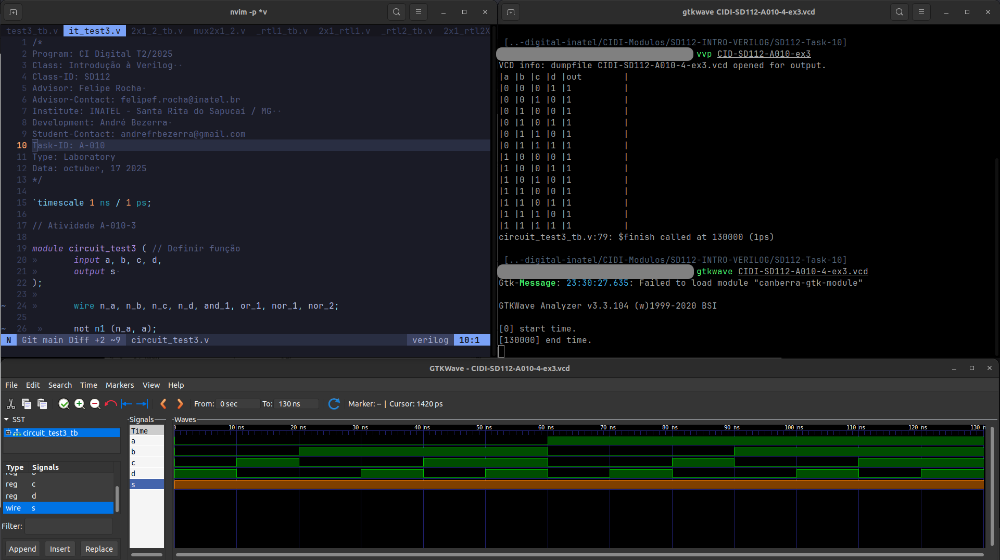

# Atividade A-010 / SD-112

> Conteúdo descritivo e analítico

:white_check_mark: Implementar uma testbench capaz de avaliar o comportamento dos códigos fornecidos anteriormente.

:white_check_mark: Pesquisar e escrever como implementar o mesmo circuito através de outro operador da linguagem Verilog.

:white_check_mark: Escreva um código Verilog que represente o funcionamento do circuito combinacional da figura abaixo utilizando descrição RTL.


## Executar

> Comandos para analisar / testar comportamento dos módulos:  

### GTKwave

```
$ vvp CIDI-SD112-A010-<...>

$ gtkwave CIDI-SD112-A010-<...>.vcd
```

### ModelSim

> 

```
$ do execute-task.do
```


## Fluxograma


## Results






[> Google Drive - General Report](https://docs.google.com/document/d/1XcMPJY77fL6TMtBvcFznFPcfbmsb3IuBN67DL6YdwVo)
