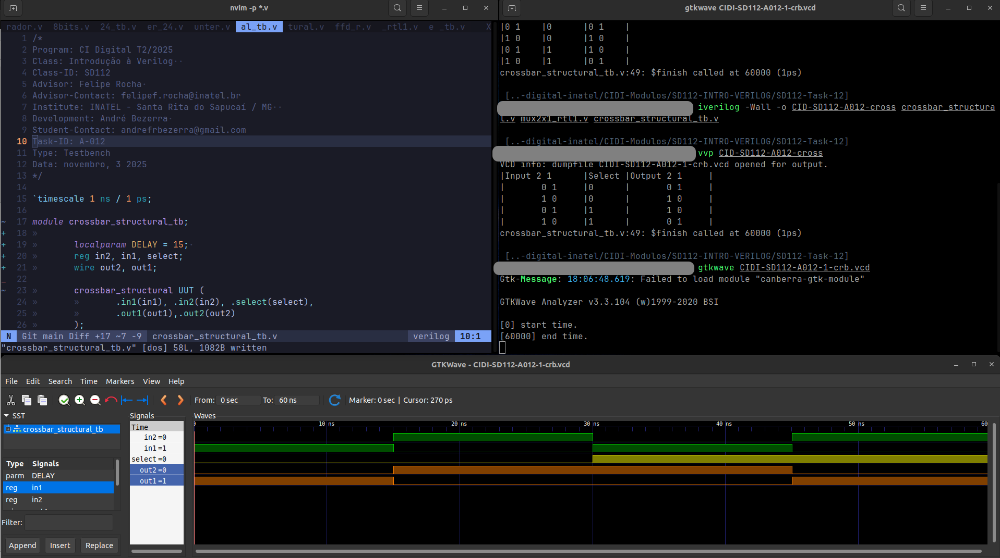

# Atividade A-012 / SD-112

> Conteúdo descritivo e analítico

> Descrição Estrutural

:white_check_mark: Definir uma testbench para validar o funcionamento do Crossbar, com base no código de exemplo desta atividade.

:white_check_mark: Descrever as vantagens das implementações apresentadas na Figura 10.

- A parametrização dos variáveis de definição do tamanho dos arrays facilitam a viabilidade de expansão / escalonamento do módulo para maior quantidade de bits. 

:white_check_mark: Implementar um contador de 24 bits de forma estrutural, seguindo o método da implementação apresentada como exemplo nesta atividade.

:white_check_mark: Dividir o código apresentado na atividade anterior (A-012) em blocos, reescrevendo-o de forma estrutural, utilizando o somador do Exercício 2 como componente do contador.

## Executar

> Comandos para analisar / testar comportamento dos módulos: 

### GTKwave

```
$ vvp CIDI-SD112-A012-1-cross

$ gtkwave CIDI-SD112-A012-1-cross.vcd
```

```
$ vvp CIDI-SD112-A012-2-<>

$ gtkwave CIDI-SD112-A012-2-<>vcd
```

```
$ vvp CIDI-SD112-A012-2-<>

$ gtkwave CIDI-SD112-A012-2-<>vcd
```

### ModelSim

> 

```
$ do execute-task.do
```


## Fluxograma


## Results




[> Google Drive - General Report](https://docs.google.com/document/d/1XcMPJY77fL6TMtBvcFznFPcfbmsb3IuBN67DL6YdwVo)
