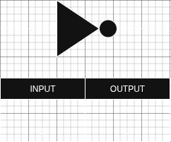
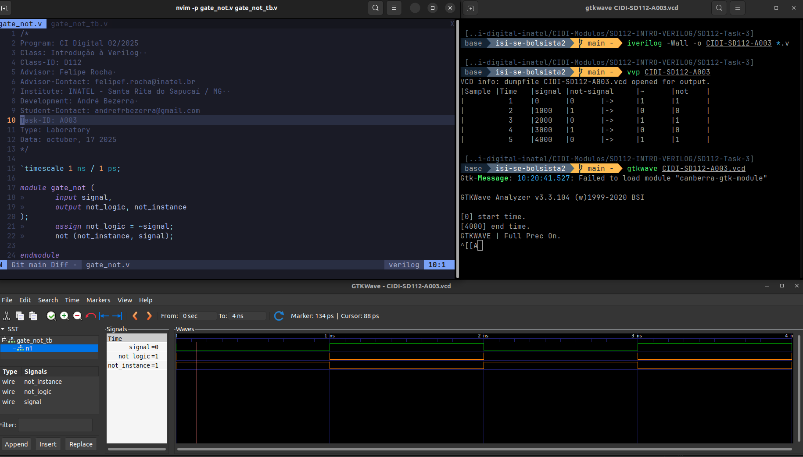

# Atividade A-003 / SD-112

:white_check_mark: Substituir ​o​ ​módulo​ ​**inv​** ​na​ ​testbench​ ​pela​ ​porta​ ​lógica​ **​NOT**​ ​nativa​ ​da​ linguagem​ ​Verilog.​ ​Qual​ ​é​ ​a​ ​diferença​ ​entre​ ​o​ ​módulo​ ​que​ ​utiliza​ ​a​ atribuição assign com o operador​​ **∼​​** e utilizar a porta​​ **NOT**​ ​?​


> A estrutura para instanciar do **not** e a dependência do *assign* pelo símbolo *~*, no mais os resultados não são comprometidos ou sofrem alteração;


:white_check_mark: Descrever ​em​ ​Verilog​ ​um​ ​módulo​ ​que​ ​implemente​ ​uma​ ​porta​ ​**AND**​ ​com​ duas​ ​entradas​ ​e​ ​uma​ ​saída.​ ​Construir​ ​uma​ ​testbench​ ​para​ ​avaliar​ ​o​ comportamento​ ​dessa​ ​porta​ ​para​ ​todas​ ​as​ ​combinações​ ​possíveis​ ​de​ entrada.​

## Executar

> Comandos para analisar / testar comportamento dos módulos: 

### GTKwave

```
$ vvp CID-SD112-A003

$ gtkwave CID-SD112-A003.vcd
```

### ModelSim

> 

```
$ do execute-task.do
```


## Fluxograma



## Results



[> Google Drive - General Report](https://docs.google.com/document/d/1XcMPJY77fL6TMtBvcFznFPcfbmsb3IuBN67DL6YdwVo)


