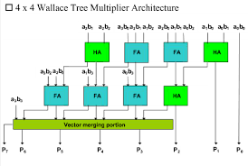

# Atividade A-115 / SD-122

> Conteúdo descritivo e analítico

> Multiplicador Wallace Tree de 4-bits

:white_check_mark: Projetar um multiplicador Wallace Tree de 4-bits em Verilog, simular seu funcionamento e verificar sua operação para diferentes entradas bin ́arias. Utilizar referências para construção. 

:white_check_mark: Teste e verifique os resultados.

:white_check_mark: Verifique que o multiplicador implementado faz uso de módulos Half e Full Adders e faz a descrição de forma estrutural.


## Executar

> Comandos para analisar / testar comportamento dos módulos: 

### GTKwave

```
$ vvp CIDI-SD122-A115

$ gtkwave CIDI-SD122-A115-wallace.vcd
```

### ModelSim

> 

```
$ do execute-task.do
```


## Fluxograma



## Results


[> Google Drive - General Report](https://docs.google.com/document/d/1XcMPJY77fL6TMtBvcFznFPcfbmsb3IuBN67DL6YdwVo)
