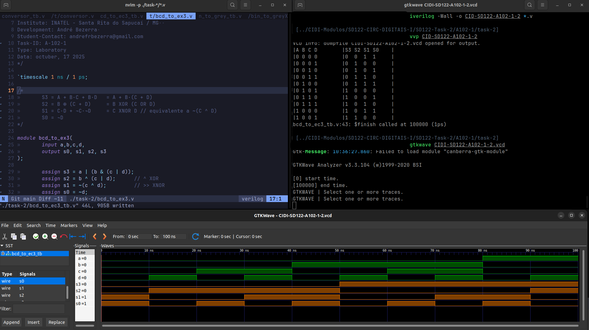
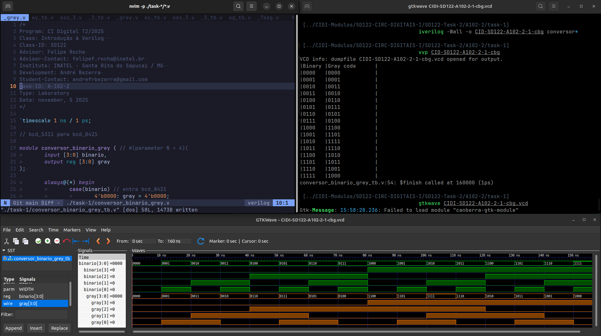
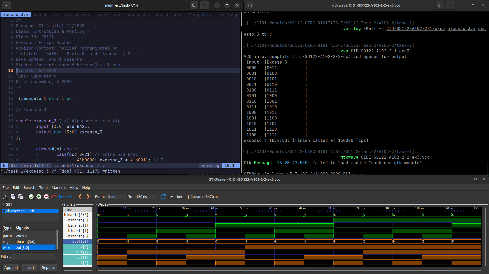
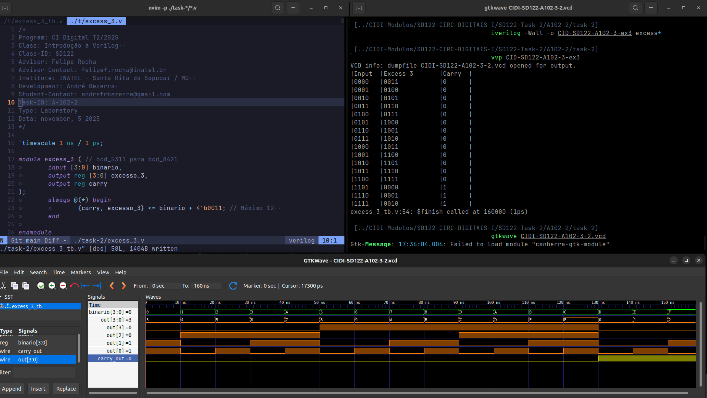

# Atividade A-102 / SD-122

> Conteúdo descritivo e analítico

## Conversores de Código - A-102-1

> Implementar:

:white_check_mark: Uma descrição estrutural do conversor de código BCD5311 para BCD8421.

:white_check_mark: Conversor de código BCD8421 para Excesso de 3.

:white_check_mark: Conversor de código binário de 4 bits para código gray.

## Conversores de Código - A-102-2

​:white_check_mark: Desenvolver uma descrição comportamental de um conversor de código binário de 4 bits para um display de 7 segmentos do tipo anodo comum.


## Executar

> Comandos para analisar / testar comportamento dos módulos: 

### GTKwave

```
$ vvp CIDI-SD122-A102-1-<...>

$ gtkwave CIDI-SD122-A102-1-<...>.vcd
```

```
$ vvp CIDI-SD122-A102-2-<...>

$ gtkwave CIDI-SD122-A102-2-<...>.vcd
```

### ModelSim

> 

```
$ do execute-task.do
```


## Fluxograma


## Results











[> Google Drive - General Report](https://docs.google.com/document/d/1XcMPJY77fL6TMtBvcFznFPcfbmsb3IuBN67DL6YdwVo)
