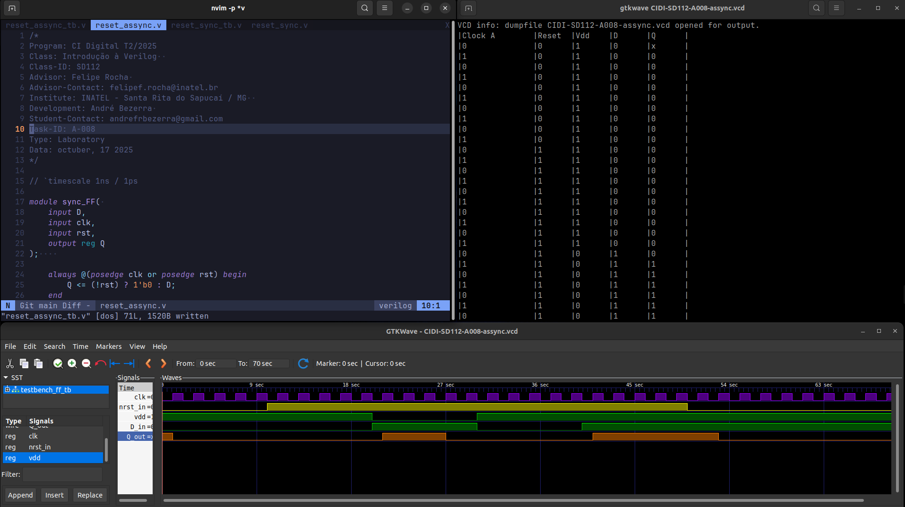

# Atividade A-008 / SD-112

> Conteúdo descritivo e analítico

> Reset Síncrono e Assíncrono

:white_check_mark: Pesquisar sobre o uso de sinais de reset do tipo ativo alto (reset) e ativo baixo (negative reset). Quais as diferenças, vantagens e desvantagens no uso de cada polaridade do sinal de reset?

- Sinais de reset ativo-alto (`reset`) e ativo-baixo (`nreset` ou `_reset`) definem a polaridade do sinal que reinicia um circuito digital. A escolha entre eles impacta a robustez e a implementação do sistema.

- As diferenças e vantagens - no **Reset Ativo-Baixo (Negative Reset):** cujo padrão é predominante na indústria de semicondutores (ASICs e FPGAs) por sua maior robustez.

> Vantagens:

1.  **Imunidade a Ruído:** Conforme John Wakerly em "Digital Design: Principles and Practices", o estado de repouso (nível lógico '1') é menos suscetível a ruídos como *ground bounce*, que tendem a puxar o sinal para '0'. Isso evita resets acidentais.

2.  **Power-On Reset (POR):** Facilita a criação de circuitos de reset na inicialização com componentes passivos (RC). Um capacitor descarregado mantém o sinal em '0' enquanto a tensão da fonte estabiliza, garantindo um reset seguro.

3.  **Lógica "Wired-AND":** Permite que múltiplas fontes de reset (com saídas *open-drain*) controlem uma única linha. Qualquer fonte que puxe a linha para '0' efetiva o reset geral.

> Desvantagens - Pode ser menos intuitivo, pois o estado "inativo" é o nível lógico alto.

**Reset Ativo-Alto:**

> Vantagem:**
    É mais intuitivo, pois o nível lógico '1' (ativo) corresponde à ação de resetar.

*   **Desvantagens:**
    1.  **Menor Imunidade a Ruído:** Um pico de ruído na alimentação (VCC) pode elevar a tensão da linha, gerando um pulso de reset falso.
    2.  **POR mais Complexo:** Um circuito POR simples com componentes passivos exigiria um inversor adicional para gerar o pulso alto, aumentando a complexidade.

Em geral, guias de design de empresas como **Xilinx** e **Intel** recomendam o uso de resets ativo-baixo como prática padrão devido às suas vantagens sistêmicas em robustez e simplicidade de implementação em cenários complexos.

:white_check_mark: Implementar em Verilog o circuito apresentado no schematic (Fluxograma).


:white_check_mark: Definir uma testbench para testar o circuito implementado e descreva o comportamento do sinal de reset sincronizado.


## Executar

> Comandos para analisar / testar comportamento dos módulos: 

### GTKwave

```
$ vvp CIDI-SD112-A008-sync

$ gtkwave CIDI-SD112-A008-sync.vcd
```

```
$ vvp CIDI-SD112-A008-assync

$ gtkwave CIDI-SD112-A008-assync.vcd
```

### ModelSim

> 

```
$ do execute-task.do
```


## Fluxograma


## Results




[> Google Drive - General Report](https://docs.google.com/document/d/1XcMPJY77fL6TMtBvcFznFPcfbmsb3IuBN67DL6YdwVo)
