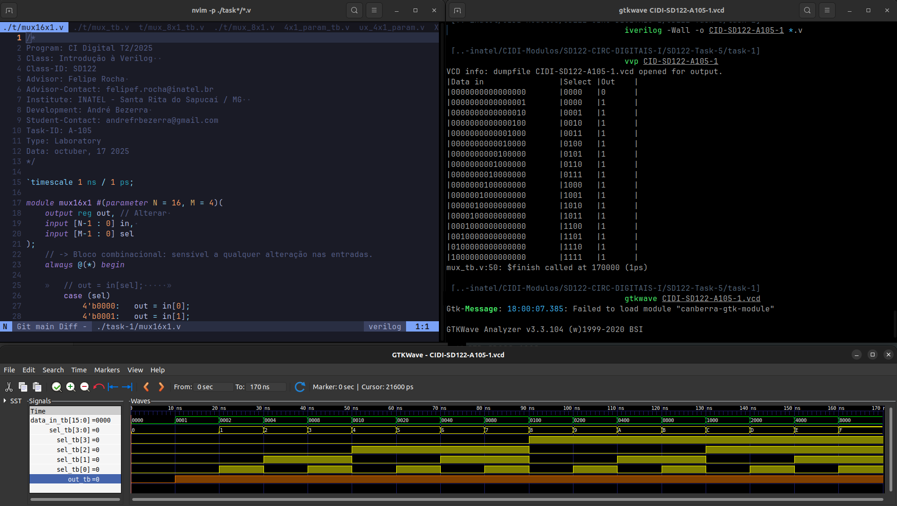
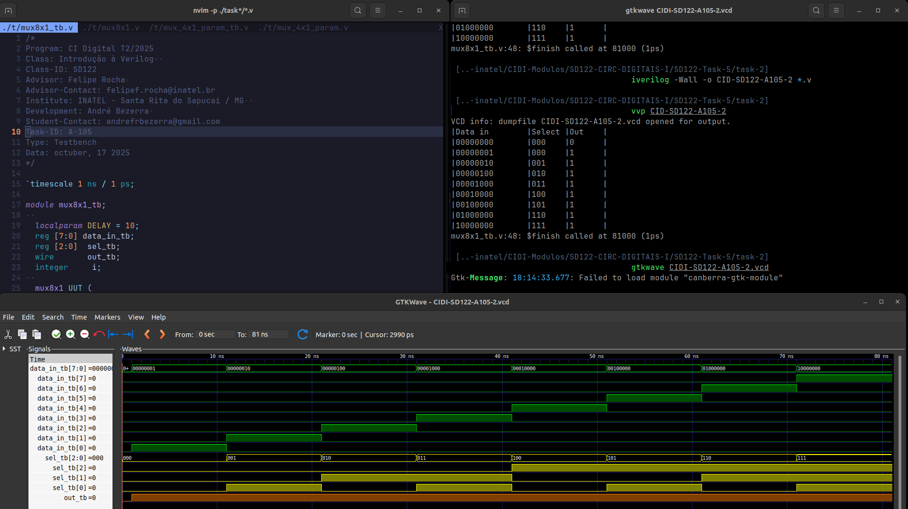

# Atividade A-105 / SD-122

> Conteúdo descritivo e analítico

> Multiplexadores​

:white_check_mark:

## Executar

> Comandos para analisar / testar comportamento dos módulos:  

### GTKwave

```
$ vvp CIDI-SD122-A105-<...>

$ gtkwave CIDI-SD122-A105-<...>.vcd
```

### ModelSim

> 

```
$ do execute-task.do
```

## Fluxograma


## Results





[> Google Drive - General Report](https://docs.google.com/document/d/1XcMPJY77fL6TMtBvcFznFPcfbmsb3IuBN67DL6YdwVo)
