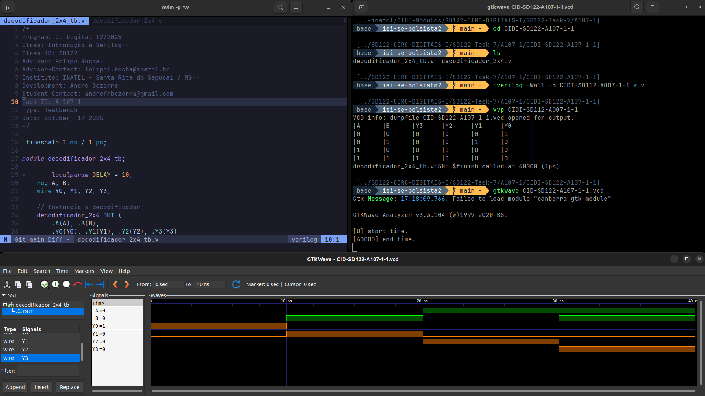
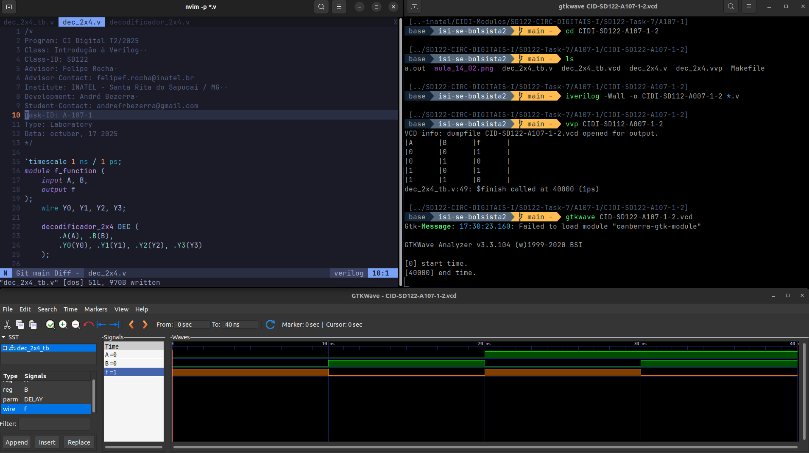

# Atividade A-107 / SD-122

> Conteúdo descritivo e analítico

:white_check_mark: Parte 1 - Decodificador

​:white_check_mark: Parte 2 - Mux

## Executar

> Comandos para analisar / testar comportamento dos módulos:  

### GTKwave

> Etapa 1

- Exemplo 1: 

```
$ vvp CIDI-SD122-A107-1-1

$ gtkwave CIDI-SD122-A107-1-1.vcd
```
- Exemplo 2: 

```
$ vvp CIDI-SD122-A107-1-2

$ gtkwave CIDI-SD122-A107-1-2.vcd
```

- Exemplo 3: 

```
$ vvp CIDI-SD122-A107-1-3

$ gtkwave CIDI-SD122-A107-1-3.vcd
```

> Etapa 2

- Exemplo 1: 

```
$ vvp CIDI-SD122-A107-2-1

$ gtkwave CIDI-SD122-A107-2-1.vcd
```
- Exemplo 2: 

```
$ vvp CIDI-SD122-A107-2-2

$ gtkwave CIDI-SD122-A107-2-2.vcd
```

- Exemplo 3: 

```
$ vvp CIDI-SD122-A107-2-3

$ gtkwave CIDI-SD122-A107-2-3.vcd
```

### ModelSim

> 

```
$ do execute-task.do
```


## Fluxograma


## Results





[> Google Drive - General Report](https://docs.google.com/document/d/1XcMPJY77fL6TMtBvcFznFPcfbmsb3IuBN67DL6YdwVo)
